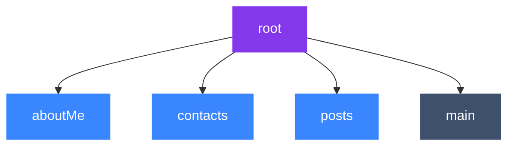

<!--
SPDX-FileCopyrightText: 2021 Anders Rune Jensen

SPDX-License-Identifier: CC0-1.0
-->

# ssb-meta-feeds

An implementation of the [ssb meta feed spec] in JS as a secret stack plugin.
The core idea is being able to split out content you publish into _subfeeds_,
which allows for quicker more targetted replication by peers (only get the subfeeds you want).


How "classic" scuttlebutt worked - each device has one `main` feed with all messages


How scuttlebutt works with meta-feeds - each device now has a `root` feed,
whose sole responsibility is to announce (point to) sub-feeds that you publish content to.

This means that when you first meet a peer you can replicate their `root` feed
and (having discovered their subfeeds), replicate just their `aboutMe` and `contacts` feeds
to get enough info to place them socially. Once you decide you want to follow them you may
replicate their other subfeeds.


_NOTE: The ideal state is that all content is split out into subfeeds.
To add backwards compatability for devices that have already posted a lot of posts to their
classic `main` feed, this library will auto-link that main feed in as a "subfeed" of our root._

## Installation

**Prerequisites:**

- Requires **Node.js 10** or higher
- Requires `ssb-db2`

```
npm install --save ssb-meta-feeds
```

Add this plugin like this:

```diff
 const sbot = SecretStack({ appKey: caps.shs })
     .use(require('ssb-db2'))
+    .use(require('ssb-meta-feeds'))
     // ...
```

## Example usage

We create a subfeed for messages which describe us under our `root` feed
```js
sbot.metafeeds.findOrCreate((err, rootFeed) => {
  console.log(rootFeed)

  // find an existing feed
  const isFeed = (feed) => feed.feedpurpose === 'aboutMe'
  // details for creating a sub-feed feed if it doesn't already exist
  const details = { feedpurpose: 'aboutMe', feedformat: 'classic' }

  sbot.metafeeds.findOrCreate(rootFeed, isFeed, details, (err, aboutMeFeed) => {
    console.log(aboutMeFeed)

    // ...
  })
})
```

Once you have these the *FeedDetail* object `aboutMeFeed` you can publish to that feed:

```js
const content = {
  type: 'about',
  name: 'baba yaga'
  description: 'lives in a hutt in the forest, swing by sometime!'
}
sbot.db.publishAs(aboutMeFeed.keys, content, cb)
```


## API

### `sbot.metafeeds.findOrCreate(cb)`

Calls back with your `root` Metafeed object which has the form:

```js
{
  metafeed: null,
  subfeed: 'ssb:feed/bendybutt-v1/sxK3OnHxdo7yGZ-28HrgpVq8nRBFaOCEGjRE4nB7CO8=',
  feedpurpose: 'root',
  feedformat: 'bendybutt-v1',
  seed: <Buffer 13 10 25 ab e3 37 20 57 19 0a 1d e4 64 13 e7 38 d2 23 11 48 7d 13 e6 3b 8f ef 72 92 7f db 96 64>,
  keys: {
    curve: 'ed25519',
    public: 'sxK3OnHxdo7yGZ+28HrgpVq8nRBFaOCEGjRE4nB7CO8=.ed25519',
    private: 'SOEx7hA9vRHrli0PZwNJ8jijH+PShmlrzz/JAKI7v6SzErc6cfF2jvIZn7bweuClWrydEEVo4IQaNETicHsI7w==.ed25519',
    id: 'ssb:feed/bendybutt-v1/sxK3OnHxdo7yGZ-28HrgpVq8nRBFaOCEGjRE4nB7CO8='
  },
  metadata: {}
```

Meaning:
- `metafeed` - the id of the feed this is underneath. As this is the topmost feed, this is empty
- `subfeed` - the id of this feed, same as `keys.id`
- `feedpurpose` - a human readable ideally unique handle for this feed
- `feedformat` - the feed format ("classic" or "bendybutt-v1" are current options)
- `seed` - the data from which is use to derive the `keys` and `id` of this feed.
- `keys` - cryptographic keys used for signing messages published by this feed (see [ssb-keys])
- `metadata` - additional data

NOTES:
- the `root` metafeed is unique - you have only one, and it has no metafeed (it's at the top!)
- if you have a legacy `main` feed, this will also set that up as a subfeed of your `root` feed.

### `sbot.metafeeds.findOrCreate(metafeed, isFeed, details, cb)`

Looks for the first subfeed of `metafeed` that satisfies the condition in `isFeed`,
or creates it matching the properties in `details`.

This is strictly concerned with meta feeds and sub feeds that **you own**, not
with those that belong to other peers.

Arguments:
- `metafeed` - the metafeed you are finding/ creating under, can be:
    - *FeedDetail* object (as returned by `findOrCreate()` or `getRoot()`)
    - *null* which is short-hand for the `rootFeed` (this will be created if doesn't exist)
- `isFeed` - method you use to find an existing *FeedDetail*, can be:
    - *function* of shape `(FeedDetail) => boolean`
    - *null* - this method will then return an arbitrary subfeed under provided `metafeed`
- `details` - used to create a new subfeed if a match for an existing one is not found, can be 
    - *Object*: 
        - `details.feedpurpose` *String* any string to characterize the purpose of this new subfeed
        - `details.feedformat` *String* either `'classic'` or `'bendybutt-v1'`
        - `details.metadata` *Object* (optional) - for containing other data
            - if `details.metadata.recps` is used, the subfeed announcement will be encrypted
    - *null* - only allowed if `metafeed` is null (i.e. the details of the `root` FeedDetail)
- `cb` *function* delivers the response, has signature `(err, FeedDetail)`, where FeedDetail is
    ```js
    {
      metafeed: 'ssb:feed/bendybutt-v1/sxK3OnHxdo7yGZ-28HrgpVq8nRBFaOCEGjRE4nB7CO8=',
      subfeed: '@I5TBH6BuCvMkSAWJXKwa2FEd8y/fUafkQ1z19PyXzbE=.ed25519',
      feedpurpose: 'chess',
      feedformat: 'classic',
      seed: <Buffer 13 10 25 ab e3 37 20 57 19 0a 1d e4 64 13 e7 38 d2 23 11 48 7d 13 e6 3b 8f ef 72 92 7f db 96 64>
      keys: {
        curve: 'ed25519',
        public: 'I5TBH6BuCvMkSAWJXKwa2FEd8y/fUafkQ1z19PyXzbE=.ed25519',
        private: 'Mxa+LL16ws7HZhetR9FbsIOsAeud+ii+9KDUisXkq08jlMEfoG4K8yRIBYlcrBrYUR3zL99Rp+RDXPX0/JfNsQ==.ed25519',
        id: '@I5TBH6BuCvMkSAWJXKwa2FEd8y/fUafkQ1z19PyXzbE=.ed25519'
      },
      metadata: { // example
        notes: 'private testing of chess dev',
        recps: ['@I5TBH6BuCvMkSAWJXKwa2FEd8y/fUafkQ1z19PyXzbE=.ed25519']
      },
    }
    ```

### `sbot.metafeeds.findById(feedId, cb)`

Given a `feedId` that is presumed to be a subfeed of some meta feed, this API
fetches the *Details* object describing that feed, which is of form:

```js
{
  metafeed,
  feedpurpose,
  feedformat,
  id,
  // seed
  // keys
  metadata
}
```

NOTE - may include `seed`, `keys` if this is one of your feeds.

### `sbot.metafeeds.findByIdSync(feedId)`

Similar to `findById`, but returns synchronously. :warning: Note, in order to
use this API, you **must** call `sbot.metafeeds.loadState(cb)` first, and wait
for `cb` to be called.

You can also call `sbot.metafeeds.ensureLoaded(feedId, cb)` on an individual
basis to make sure that `findByIdSync` will operate at the correct time when the
`feedId`'s metadata has been processed in the local database.

### `sbot.metafeeds.branchStream(opts)`

Returns a **[pull-stream] source** of all "branches" in the meta feed trees.

A "branch" is an array where the first item is the root meta feed and the
subsequent items are the children and grandchildren (and etc) of the root. A
branch looks like this:

```js
[
  [rootMetafeedId, null],
  [childMetafeedId, childDetails],
  [grandchildMetafeedId, grandchildDetails],
]
```

Or in general, an `Array<[FeedId, Details | null]>`. The *Details* object has
the shape `{ feedpurpose, feedformat, metafeed, metadata }` like in `findById`.

`branchStream` will emit all possible branches, which means sub-branches are
included. For instance, in the example above, `branchStream` would emit:

```js
[
  [rootMetafeedId, null]
]
```

and

```js
[
  [rootMetafeedId, null],
  [childMetafeedId, childDetails],
]
```

and

```js
[
  [rootMetafeedId, null],
  [childMetafeedId, childDetails],
  [grandchildMetafeedId, grandchildDetails],
]
```

The `opts` argument can have the following properties:

- `opts.root` _String_ - a feed ID for a meta feed, only branches that are
  descendants of this feed ID would appear in the pull-stream source, otherwise
  all branches from all possible root meta feeds will be included. (Default:
  `null`)
- `opts.old` _Boolean_ - whether or not to include currently loaded (by
  `loadState`) trees. (Default: `false`)
- `opts.live` _Boolean_ - whether or not to include subsequent meta feed trees
  during the execution of your program. (Default: `true`)
- `opts.tombstoned` _Boolean_ - if `false`, no tombstoned branches are included
  in the results; if `true`, only tombstoned branches are included; if `null`,
  all branches are included regardless of tombstoning. (Default: `null`)


### `sbot.metafeeds.findAndTombstone(metafeed, isFeed, reason, cb)`

_Looks for the first subfeed of `metafeed` that satisfies the condition in
`isFeed` and, if found, tombstones it with the string `reason`.

This is strictly concerned with meta feeds and sub feeds that **you own**, not
with those that belong to other peers.

Arguments: 
- `metafeed` *FeedDetail* object (as returned by e.g. `findOrCreate()`, `getRoot()`).
- `isFeed` *function* of the shape `(FeedDetail) => Boolean`.
- `reason` *String* - describes why the found feed is being tombstoned.

The callback is called with `true` on the 2nd argument if tombstoning suceeded,
or called with an error object on the 1st argument if it failed.


### `sbot.metafeeds.getRoot(cb)`

Looks for the root meta feed declared by your main feed, and returns it (as
`{ seed, keys}`) via the callback `cb` if it exists.

If it does not exist, this API will **not** create the root meta feed.


## Validation

Exposed via the internal API.

### `isValid(msg, hmacKey)`

_Validate a single meta feed message._

Extracts the `contentSection` from the given `msg` object and calls
`validateSingle()` to perform validation checks.

If provided, the `hmacKey` is also given as input to the `validateSingle()`
function call. `hmacKey` may be `null` or a valid HMAC key supplied as a
`Buffer` or `string`.

The response is a boolean: `true` if validation is successful, `false` if
validation fails in any way. Note that this function does not return the
underlying cause of the validation failure.

### `validateSingle(contentSection, hmacKey)`

_Validate a single meta feed message `contentSection` according to the criteria
defined in the [specification](https://github.com/ssb-ngi-pointer/ssb-meta-feed-spec#usage-of-bendy-butt-feed-format)._

`contentSection` must be an array of `content` and `contentSignature`. If a
`string` is provided (representing an encrypted message, for instance) an error
will be returned; an encrypted `contentSection` cannot be validated.

`hmacKey` may be `null` or a valid HMAC key supplied as a `Buffer` or `string`.

The response will be `undefined` (for successful validation) or an `Error`
object with a `message` describing the error.

### `validateMetafeedAnnounce(msg)`

_Validates a `metafeed/announce` message expected to be published on "main"
feeds which are in the classic format, but are signed by a meta feed according
to the [ssb meta feed spec]._

The response will be `undefined` (for successful validation) or an `Error`
object with a `message` describing the error.

## License

LGPL-3.0

[ssb-keys]: https://github.com/ssb-js/ssb-keys
[ssb meta feed spec]: https://github.com/ssb-ngi-pointer/ssb-meta-feed-spec
[pull-stream]: https://github.com/pull-stream/pull-stream/
