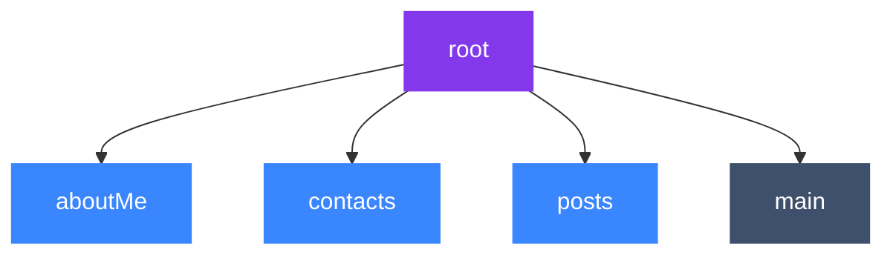

<!--
SPDX-FileCopyrightText: 2021 Anders Rune Jensen

SPDX-License-Identifier: CC0-1.0
-->

# ssb-meta-feeds

An implementation of the [ssb metafeed spec] in JS as a secret stack plugin.
The core idea is being able to split out content you publish into _subfeeds_.
This allows for quicker replication by peers, such that you only get the
subfeeds, thus content types, you are interested in.

Metafeeds are special types of feeds which own or "contain" other feeds (called
"subfeeds"), by publishing messages which describe the creation of the subfeeds.


_How "classic" scuttlebutt worked - each device has one `main` feed with all messages_


_How scuttlebutt works with metafeeds - each device now has a `root` metafeed,
whose sole responsibility is to announce (point to) subfeeds that you publish
content to. A subfeed can also be a metafeed, which then allows the existence of
"sub-subfeeds"._

This means that when you first meet a peer you can replicate their `root`
metafeed and, having discovered their subfeeds, replicate just their `aboutMe`
and `contacts` feeds to get enough info to place them socially. Once you decide
you want to follow them you may replicate their other subfeeds.

_NOTE: The ideal state is that all content is split out into subfeeds.  To add
backwards compatability for devices that have already posted a lot of posts to
their classic `main` feed, this library will auto-link that main feed in as a
"subfeed" of our root._

## Installation

**Prerequisites:**

- Requires **Node.js 10** or higher
- Requires `ssb-db2` version 5.0 or higher
- Requires `ssb-bendy-butt` version 1.0 or higher

```
npm install --save ssb-meta-feeds
```

Add this plugin like this:

```diff
 const sbot = SecretStack({ appKey: caps.shs })
     .use(require('ssb-db2'))
+    .use(require('ssb-meta-feeds'))
     // ...
```

## Example usage

We create a subfeed for `about` messages under our `root` feed using
`findOrCreate`. This will only create the subfeed if there is no existing
subfeed that matches the criteria.

```js
const details = { feedpurpose: 'aboutMe' }
sbot.metafeeds.findOrCreate(details, (err, aboutMeFeed) => {
  console.log(aboutMeFeed)

  //
})
```

The `details` argument is an object used to find (or create) a subfeed under
your "root feed". (It actually nests it under a couple of subfeeds, to handle
versioning, and sparse replication, but you generally don't need to know the
details).

Once you have a *FeedDetails* object, like `aboutMeFeed`, you can publish on
the new subfeed:

```js
const details = { feedpurpose: 'aboutMe' }
sbot.metafeeds.findOrCreate(details, (err, aboutMeFeed) => {
  console.log(aboutMeFeed)

  const content = {
    type: 'about',
    name: 'baba yaga'
    description: 'lives in a hutt in the forest, swing by sometime!'
  }
  sbot.db.create({ keys: aboutMeFeed.keys, content }, (err, msg) => {
    console.log(msg)
  })
})
```

## API

### `sbot.metafeeds.findOrCreate(details, cb)`

Looks for the first subfeed of `metafeed` that matches `details`, or creates
one which matches these. This creates feeds following the
[v1 tree structure](https://github.com/ssbc/ssb-meta-feeds-spec#v1).

Arguments:
- `details` *Object* where 
    - `details.feedpurpose` *String* any string to characterize the purpose of this new subfeed
    - `details.feedformat` *String* (optional)
        - either `'classic'` or `'bendybutt-v1'`
        - default: `'classic'`
    - `details.recps` *Array* (optional)
       - A collection of "recipients" (GroupId, FeedId, ...) to encrypt the announcement messages to 
    - `details.encryptionFormat` *String* (optional)
       - specifies which encrption format to use (you will need an encrption plugin installed e.g. `ssb-box2` installed)
       - default: `'box2'`
    - `details.metadata` *Object* (optional) - for containing other data

- `cb` *function* delivers the response, has signature `(err, FeedDetails)`, where FeedDetails is
    ```js
    {
      metafeed: 'ssb:feed/bendybutt-v1/sxK3OnHxdo7yGZ-28HrgpVq8nRBFaOCEGjRE4nB7CO8=',
      subfeed: '@I5TBH6BuCvMkSAWJXKwa2FEd8y/fUafkQ1z19PyXzbE=.ed25519',
      feedpurpose: 'chess',
      feedformat: 'classic',
      seed: <Buffer 13 10 25 ab e3 37 20 57 19 0a 1d e4 64 13 e7 38 d2 23 11 48 7d 13 e6 3b 8f ef 72 92 7f db 96 64>
      keys: {
        curve: 'ed25519',
        public: 'I5TBH6BuCvMkSAWJXKwa2FEd8y/fUafkQ1z19PyXzbE=.ed25519',
        private: 'Mxa+LL16ws7HZhetR9FbsIOsAeud+ii+9KDUisXkq08jlMEfoG4K8yRIBYlcrBrYUR3zL99Rp+RDXPX0/JfNsQ==.ed25519',
        id: '@I5TBH6BuCvMkSAWJXKwa2FEd8y/fUafkQ1z19PyXzbE=.ed25519'
      },
      recps: ['%I5TBH6BuCvMkSAWJXKwa2FEd8y/fUafkQ1z19PyXzbE=.cloaked'], // a GroupId
      metadata: {
        notes: 'private testing of chess dev',
      },
    }
    ```

Meaning:
- `metafeed` - the id of the feed this is underneath
- `subfeed` - the id of this feed, same as `keys.id`
- `feedpurpose` - a human readable ideally unique handle for this feed
- `feedformat` - the feed format ("classic" or "bendybutt-v1" are current options)
- `seed` - the data from which is use to derive the `keys` and `id` of this feed.
- `keys` - cryptographic keys used for signing messages published by this feed (see [ssb-keys])
- `recps` - an Array of recipients who the meta-feed announcement was encrpted to
- `metadata` - object containing additional data

NOTES:
- if you have a legacy `main` feed, this will also set that up as a subfeed of your `root` feed.


### `sbot.metafeeds.findOrCreate(cb)`

Fetches the **root metafeed** details. There can only be one _root_ metafeed,
so even if you call `findOrCreate(cb)` many times, it will not create duplicates,
it will just load the root metafeed.

Callsback with your `root` FeedDetails object (see `findOrCreate(details, cb)`)

NOTES: 
- `metafeed = null` - the root metafeed is the topmost metafeed

### `sbot.metafeeds.branchStream(opts)`

Returns a **[pull-stream] source** of all "branches" in the meta feed trees.

A "branch" is an array where the first item is the root meta feed and the
subsequent items are the children and grandchildren (and etc) of the root. A
branch looks like this:

```js
[
  [rootMetafeedId, rootDetails],
  [childMetafeedId, childDetails],
  [grandchildMetafeedId, grandchildDetails],
]
```

Or in general, an `Array<[FeedId, Details]>`. The *Details* object has
the shape `{ feedpurpose, feedformat, metafeed, metadata }` like in `findById`.

`branchStream` will emit all possible branches, which means sub-branches are
included. For instance, in the example above, `branchStream` would emit:

```js
[
  [rootMetafeedId, null]
]
```

and

```js
[
  [rootMetafeedId, null],
  [childMetafeedId, childDetails],
]
```

and

```js
[
  [rootMetafeedId, null],
  [childMetafeedId, childDetails],
  [grandchildMetafeedId, grandchildDetails],
]
```

The `opts` argument can have the following properties:

- `opts.root` _String_ - a feed ID for a meta feed, only branches that are
  descendants of this feed ID would appear in the pull-stream source, otherwise
  all branches from all possible root meta feeds will be included. (Default:
  `null`)
- `opts.old` _Boolean_ - whether or not to include currently loaded (by
  `loadState`) trees. (Default: `false`)
- `opts.live` _Boolean_ - whether or not to include subsequent meta feed trees
  during the execution of your program. (Default: `true`)
- `opts.tombstoned` _Boolean_ - if `false`, no tombstoned branches are included
  in the results; if `true`, only tombstoned branches are included; if `null`,
  all branches are included regardless of tombstoning. (Default: `null`)

### `sbot.metafeeds.findAndTombstone(details, reason, cb)`

Looks for the first subfeed that matches `details` and, if found,
tombstones it with the string `reason`.

This is strictly concerned with metafeeds and sub feeds that **you own**, not
with those that belong to other peers.

Arguments:
- `details` *Object* - see `#findOrCreate`
- `reason` *String* - describes why the found feed is being tombstoned.

The callback is called with `true` on the 2nd argument if tombstoning suceeded,
or called with an error object on the 1st argument if it failed.


### Advanced API

For lower level API docs, [see here](./README_ADVANCED.md).

## License

LGPL-3.0

[ssb-keys]: https://github.com/ssb-js/ssb-keys
[ssb metafeed spec]: https://github.com/ssb-ngi-pointer/ssb-meta-feed-spec
[pull-stream]: https://github.com/pull-stream/pull-stream/
